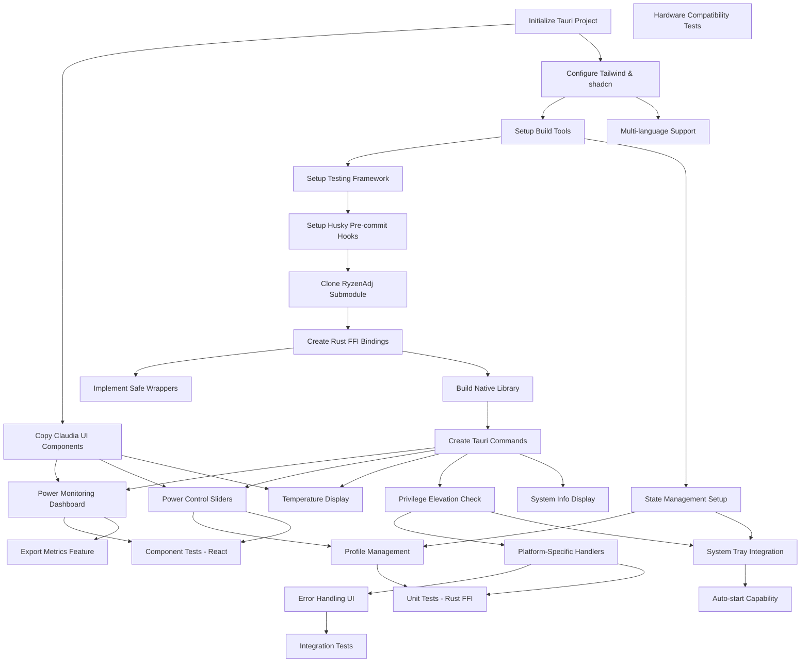

# Resonance Development Plan

## Overview

This document provides a comprehensive, ordered development plan for creating
the resonance application. Each task includes dependencies, estimated time, and
success criteria.

## Development Approach: Test-Driven Development (TDD)

This project follows TDD principles throughout all phases:

1. **Write Tests First**: Before implementing any feature, write failing tests
   that define the expected behavior
2. **Implement to Pass**: Write the minimum code necessary to make tests pass
3. **Refactor**: Improve code quality while keeping tests green
4. **Continuous Testing**: Every commit must pass all tests via pre-commit hooks

Testing is integrated into each task, not treated as a separate phase. This
ensures:

- Higher code quality and fewer bugs
- Better design through test-first thinking
- Confidence in refactoring
- Living documentation through tests
- Faster debugging when issues arise

## Task Dependency Graph



## Phase 0: Project Setup (Day 1-2)

### TASK-001: Initialize Tauri Project

- **Priority**: P0 (Critical)
- **Estimated**: 1-2 hours
- **Dependencies**: None
- **Blocks**: All other tasks

**Description**: Create the base Tauri project with React TypeScript template.

**Success Criteria**:

- [ ] Tauri project initialized with React TypeScript
- [ ] Basic project structure created
- [ ] Development server runs successfully
- [ ] Basic window opens with React app

**Commands**:

```bash
npm create tauri-app@latest resonance -- --template react-ts
cd resonance
bun install  # or npm install
```

### TASK-002: Copy Claudia UI Components

- **Priority**: P0 (Critical)
- **Estimated**: 2-3 hours
- **Dependencies**: TASK-001
- **Blocks**: All UI development

**Description**: Copy the UI component library from Claudia project.

**Success Criteria**:

- [ ] `src/components/ui/` directory copied
- [ ] `src/lib/utils.ts` copied
- [ ] All component dependencies resolved
- [ ] Components compile without errors

**Files to Copy**:

- `/home/dwalleck/repos/claudia/src/components/ui/*`
- `/home/dwalleck/repos/claudia/src/lib/utils.ts`
- Relevant type definitions

### TASK-003: Configure Tailwind CSS & shadcn/ui

- **Priority**: P0 (Critical)
- **Estimated**: 1-2 hours
- **Dependencies**: TASK-001
- **Blocks**: UI styling

**Description**: Set up Tailwind CSS and shadcn/ui configuration.

**Success Criteria**:

- [ ] Tailwind CSS installed and configured
- [ ] shadcn/ui dependencies added
- [ ] CSS variables configured
- [ ] Dark mode support enabled
- [ ] Example component renders with styling

**Dependencies to Install**:

```json
{
  "@radix-ui/react-*": "latest",
  "class-variance-authority": "^0.7.1",
  "clsx": "^2.1.1",
  "lucide-react": "latest",
  "tailwind-merge": "^2.6.0",
  "tailwindcss": "^3.4.0"
}
```

### TASK-004: Setup Build Tools

- **Priority**: P0 (Critical)
- **Estimated**: 1 hour
- **Dependencies**: TASK-003
- **Blocks**: Development workflow

**Description**: Configure Vite, TypeScript, and linting tools.

**Success Criteria**:

- [ ] TypeScript strict mode enabled
- [ ] ESLint configured for React/TypeScript
- [ ] dprint configured for formatting
- [ ] Build scripts working
- [ ] Hot reload functioning

### TASK-005: Setup Testing Framework

- **Priority**: P0 (Critical)
- **Estimated**: 2-3 hours
- **Dependencies**: TASK-004
- **Blocks**: All feature development

**Description**: Configure testing frameworks for both React and Rust code.

**Success Criteria**:

- [ ] Vitest configured for React/TypeScript
- [ ] React Testing Library installed
- [ ] Rust test structure set up
- [ ] Mock Tauri APIs configured
- [ ] Test scripts in package.json
- [ ] Coverage reporting configured
- [ ] Example tests passing

**Setup Commands**:

```bash
# Install testing dependencies
bun add -D vitest @testing-library/react @testing-library/user-event @testing-library/jest-dom
bun add -D @vitest/coverage-v8 jsdom

# Install Tauri testing utilities
bun add -D @tauri-apps/api
```

**Vitest Configuration** (vite.config.ts):

```typescript
import react from '@vitejs/plugin-react';
import { defineConfig } from 'vite';

export default defineConfig({
  plugins: [react()],
  test: {
    globals: true,
    environment: 'jsdom',
    setupFiles: './src/test/setup.ts',
    coverage: {
      reporter: ['text', 'json', 'html'],
    },
  },
});
```

### TASK-006: Setup Husky Pre-commit Hooks

- **Priority**: P0 (Critical)
- **Estimated**: 1-2 hours
- **Dependencies**: TASK-005
- **Blocks**: Development workflow

**Description**: Configure Husky with pre-commit hooks for code quality.

**Success Criteria**:

- [ ] Husky installed and initialized
- [ ] Pre-commit hook configured
- [ ] dprint formatting on commit
- [ ] ESLint checking on commit
- [ ] TypeScript type checking on commit
- [ ] Tests run on commit (when available)
- [ ] Commit fails if any checks fail

**Setup Commands**:

```bash
# Install Husky and lint-staged
bun add -D husky lint-staged dprint

# Initialize Husky
bunx husky init

# Create pre-commit hook
echo "bunx lint-staged" > .husky/pre-commit
```

**lint-staged Configuration** (package.json):

```json
{
  "lint-staged": {
    "*.{ts,tsx,js,jsx}": [
      "dprint fmt",
      "eslint --fix"
    ],
    "*.{json,md,yml,yaml}": [
      "dprint fmt"
    ],
    "*.rs": [
      "cargo fmt --"
    ]
  }
}
```

**dprint Configuration** (dprint.json):

````json
{
  "typescript": {
    "semiColons": "prefer",
    "quoteStyle": "preferDouble",
    "indentWidth": 2,
    "useTabs": false
  },
  "json": {
    "indentWidth": 2
  },
  "markdown": {
    "lineWidth": 80
  },
  "includes": ["**/*.{ts,tsx,js,jsx,json,md}"],
  "excludes": ["**/node_modules", "**/dist", "**/target"]
}

## Phase 1: FFI Integration (Day 3-5)

### TASK-007: Clone RyzenAdj as Submodule

- **Priority**: P1 (High)
- **Estimated**: 1 hour
- **Dependencies**: TASK-006
- **Blocks**: All FFI work

**Description**: Add RyzenAdj as a git submodule and set up build process.

**Success Criteria**:

- [ ] RyzenAdj cloned as submodule
- [ ] Build script for libryzenadj created
- [ ] C headers accessible to Rust
- [ ] Library builds successfully

**Commands**:

```bash
git submodule add https://github.com/FlyGoat/RyzenAdj.git lib/RyzenAdj
cd lib/RyzenAdj
mkdir build && cd build
cmake ..
make
````

### TASK-008: Create Rust FFI Bindings with Tests

- **Priority**: P1 (High)
- **Estimated**: 4-6 hours
- **Dependencies**: TASK-007
- **Blocks**: TASK-009, TASK-010

**Description**: Create Rust FFI bindings for RyzenAdj C library using TDD
approach.

**Success Criteria**:

- [ ] Write failing tests for FFI wrapper functions
- [ ] FFI bindings created in `src-tauri/src/ryzenadj/mod.rs`
- [ ] All necessary functions declared
- [ ] Types properly mapped
- [ ] Linking configured in build.rs
- [ ] All tests passing
- [ ] Mock FFI functions for testing

**Key Functions to Bind**:

```rust
extern "C" {
    fn init_ryzenadj() -> *mut c_void;
    fn cleanup_ryzenadj(ry: *mut c_void);
    fn get_stapm_limit(ry: *mut c_void) -> f32;
    fn set_stapm_limit(ry: *mut c_void, value: u32) -> i32;
    fn get_fast_limit(ry: *mut c_void) -> f32;
    fn set_fast_limit(ry: *mut c_void, value: u32) -> i32;
    fn get_slow_limit(ry: *mut c_void) -> f32;
    fn set_slow_limit(ry: *mut c_void, value: u32) -> i32;
    fn get_tctl_temp(ry: *mut c_void) -> f32;
    fn set_tctl_temp(ry: *mut c_void, value: u32) -> i32;
}
```

**Test Example**:

````rust
#[cfg(test)]
mod tests {
    use super::*;
    
    #[test]
    fn test_ryzenadj_init_success() {
        // Mock successful initialization
        let ryzenadj = RyzenAdj::new();
        assert!(ryzenadj.is_ok());
    }
    
    #[test]
    fn test_get_power_metrics() {
        let ryzenadj = RyzenAdj::new().unwrap();
        let metrics = ryzenadj.get_metrics();
        assert!(metrics.is_ok());
    }
}

### TASK-009: Implement Safe Wrappers with Tests

- **Priority**: P1 (High)
- **Estimated**: 3-4 hours
- **Dependencies**: TASK-008
- **Blocks**: TASK-010, TASK-024

**Description**: Create safe Rust wrappers around unsafe FFI calls using TDD.

**Success Criteria**:

- [ ] Write tests for error conditions first
- [ ] RyzenAdj struct with safe methods
- [ ] Proper error handling with Result types
- [ ] Null pointer checks tested
- [ ] Thread safety with Mutex tested
- [ ] Drop trait for cleanup tested
- [ ] 90%+ test coverage

**Example Structure**:

```rust
pub struct RyzenAdj {
    handle: *mut c_void,
    _phantom: PhantomData<*mut c_void>,
}

unsafe impl Send for RyzenAdj {}
unsafe impl Sync for RyzenAdj {}

impl RyzenAdj {
    pub fn new() -> Result<Self, String> { ... }
    pub fn get_metrics(&self) -> Result<PowerMetrics, String> { ... }
    pub fn set_power_limits(&self, limits: PowerLimits) -> Result<(), String> { ... }
}
````

### TASK-010: Build Native Library Integration

- **Priority**: P1 (High)
- **Estimated**: 2-3 hours
- **Dependencies**: TASK-008
- **Blocks**: TASK-010

**Description**: Set up build process to compile and link libryzenadj.

**Success Criteria**:

- [ ] build.rs script created
- [ ] Library paths configured
- [ ] Cross-platform build working
- [ ] Static linking configured
- [ ] CI/CD compatible

### TASK-011: Create Tauri Commands with Tests

- **Priority**: P1 (High)
- **Estimated**: 3-4 hours
- **Dependencies**: TASK-010
- **Blocks**: All frontend features

**Description**: Implement Tauri commands for frontend-backend communication
using TDD.

**Success Criteria**:

- [ ] Write tests for each command first
- [ ] Commands created in `src-tauri/src/commands/`
- [ ] Error handling implemented and tested
- [ ] Type definitions exported
- [ ] Commands registered in main.rs
- [ ] Mock RyzenAdj for testing
- [ ] All command tests passing

**Key Commands**:

```rust
#[tauri::command]
async fn get_power_metrics() -> Result<PowerMetrics, String> { ... }

#[tauri::command]
async fn set_power_limits(limits: PowerLimits) -> Result<(), String> { ... }

#[tauri::command]
async fn get_system_info() -> Result<SystemInfo, String> { ... }

#[tauri::command]
async fn check_privileges() -> Result<bool, String> { ... }
```

**Test Example**:

````rust
#[cfg(test)]
mod tests {
    use super::*;
    
    #[tokio::test]
    async fn test_get_power_metrics_success() {
        let result = get_power_metrics().await;
        assert!(result.is_ok());
        let metrics = result.unwrap();
        assert!(metrics.stapm_limit > 0.0);
    }
    
    #[tokio::test]
    async fn test_set_power_limits_validation() {
        let invalid_limits = PowerLimits {
            stapm_limit: 100, // Too low
            fast_limit: 25000,
            slow_limit: 25000,
        };
        let result = set_power_limits(invalid_limits).await;
        assert!(result.is_err());
    }
}

## Phase 2: Core Features (Day 6-10)

### TASK-012: Power Monitoring Dashboard with Tests

- **Priority**: P1 (High)
- **Estimated**: 1 day
- **Dependencies**: TASK-002, TASK-011
- **Blocks**: None

**Description**: Create the main power monitoring dashboard component using TDD.

**Success Criteria**:

- [ ] Write component tests first
- [ ] Real-time power metrics display
- [ ] Line charts for historical data
- [ ] 1-second polling interval tested
- [ ] Responsive layout tested
- [ ] Loading states tested
- [ ] Error states tested
- [ ] Mock Tauri commands in tests

**Components**:

- `PowerDashboard.tsx` - Main container
- `MetricCard.tsx` - Individual metric display
- `PowerChart.tsx` - Recharts line graph

**Test Example**:
```typescript
// PowerDashboard.test.tsx
import { render, screen, waitFor } from '@testing-library/react'
import { vi } from 'vitest'
import { PowerDashboard } from './PowerDashboard'

// Mock Tauri commands
vi.mock('@tauri-apps/api/tauri', () => ({
  invoke: vi.fn().mockResolvedValue({
    stapm_limit: 25.0,
    fast_limit: 30.0,
    slow_limit: 25.0,
    tctl_temp: 65.5
  })
}))

describe('PowerDashboard', () => {
  it('displays power metrics after loading', async () => {
    render(<PowerDashboard />)
    
    expect(screen.getByText(/loading/i)).toBeInTheDocument()
    
    await waitFor(() => {
      expect(screen.getByText(/25\.0W/)).toBeInTheDocument()
      expect(screen.getByText(/65\.5°C/)).toBeInTheDocument()
    })
  })
  
  it('handles error states gracefully', async () => {
    vi.mocked(invoke).mockRejectedValueOnce(new Error('No privileges'))
    render(<PowerDashboard />)
    
    await waitFor(() => {
      expect(screen.getByText(/error/i)).toBeInTheDocument()
    })
  })
})

### TASK-013: Power Control Sliders with Tests

- **Priority**: P1 (High)
- **Estimated**: 6-8 hours
- **Dependencies**: TASK-002, TASK-011
- **Blocks**: TASK-016

**Description**: Implement power limit control sliders.

**Success Criteria**:

- [ ] Sliders for STAPM, Fast, Slow limits
- [ ] Range validation (5W-54W)
- [ ] Debounced updates
- [ ] Visual feedback on change
- [ ] Error handling for failed updates

### TASK-014: Temperature Display with Tests

- **Priority**: P1 (High)
- **Estimated**: 4 hours
- **Dependencies**: TASK-002, TASK-011
- **Blocks**: None

**Description**: Create temperature monitoring display.

**Success Criteria**:

- [ ] Current temperature display
- [ ] Temperature limit control
- [ ] Visual indicators (color coding)
- [ ] Historical temperature graph

### TASK-015: State Management Setup with Tests

- **Priority**: P1 (High)
- **Estimated**: 4-6 hours
- **Dependencies**: TASK-004
- **Blocks**: TASK-016

**Description**: Set up Zustand store for application state.

**Success Criteria**:

- [ ] Power metrics store created
- [ ] Polling logic implemented
- [ ] History management (60 points)
- [ ] Settings persistence
- [ ] Error state handling

### TASK-016: Profile Management with Tests

- **Priority**: P1 (High)
- **Estimated**: 1 day
- **Dependencies**: TASK-013, TASK-015
- **Blocks**: None

**Description**: Implement power profile system.

**Success Criteria**:

- [ ] Default profiles (Balanced, Performance, Battery)
- [ ] Custom profile creation
- [ ] Profile persistence
- [ ] Quick profile switching
- [ ] Import/export profiles

## Phase 3: Platform Features (Day 11-13)

### TASK-017: Privilege Elevation Check

- **Priority**: P1 (High)
- **Estimated**: 4-6 hours
- **Dependencies**: TASK-011
- **Blocks**: TASK-018

**Description**: Implement admin/root privilege checking.

**Success Criteria**:

- [ ] Windows admin detection
- [ ] Linux root detection
- [ ] Clear user messaging
- [ ] Elevation request handling

### TASK-018: Platform-Specific Handlers

- **Priority**: P1 (High)
- **Estimated**: 1 day
- **Dependencies**: TASK-017
- **Blocks**: TASK-021

**Description**: Handle platform differences for Windows/Linux.

**Success Criteria**:

- [ ] Platform detection
- [ ] OS-specific code paths
- [ ] Different UI elements per platform
- [ ] Platform-specific error messages

### TASK-019: Error Handling UI

- **Priority**: P1 (High)
- **Estimated**: 6 hours
- **Dependencies**: TASK-017
- **Blocks**: None

**Description**: Create comprehensive error handling UI.

**Success Criteria**:

- [ ] Error boundary component
- [ ] User-friendly error messages
- [ ] Hardware compatibility warnings
- [ ] Fallback UI states
- [ ] Recovery actions

### TASK-020: System Information Display

- **Priority**: P2 (Medium)
- **Estimated**: 4 hours
- **Dependencies**: TASK-011
- **Blocks**: None

**Description**: Show CPU and system information.

**Success Criteria**:

- [ ] CPU model detection
- [ ] Supported features display
- [ ] System specs summary
- [ ] Compatibility indicators

## Phase 4: Testing & Validation (Day 14-17)

### TASK-021: Integration Tests - Full Stack

- **Priority**: P1 (High)
- **Estimated**: 1 day
- **Dependencies**: TASK-016, TASK-018
- **Blocks**: None

**Description**: Write end-to-end integration tests for the full application stack.

**Success Criteria**:

- [ ] Test frontend-to-backend flow
- [ ] Test profile switching
- [ ] Test error recovery
- [ ] Test real-time updates
- [ ] Mock hardware for CI/CD

### TASK-022: Performance Testing

- **Priority**: P1 (High)
- **Estimated**: 1 day
- **Dependencies**: TASK-012, TASK-013
- **Blocks**: None

**Description**: Test application performance and resource usage.

**Success Criteria**:

- [ ] Memory usage profiling
- [ ] CPU usage monitoring
- [ ] 1-second polling performance
- [ ] Chart rendering performance
- [ ] Large dataset handling


### TASK-023: Hardware Compatibility Tests

- **Priority**: P1 (High)
- **Estimated**: 2-3 days
- **Dependencies**: TASK-019
- **Blocks**: Release

**Description**: Test on various AMD Ryzen CPUs.

**Success Criteria**:

- [ ] Test on Ryzen 5000 series
- [ ] Test on Ryzen 6000 series
- [ ] Test on Ryzen 7000 series
- [ ] Document compatibility
- [ ] Handle unsupported hardware

## Phase 5: Polish & Advanced Features (Day 18-25)

### TASK-024: System Tray Integration

- **Priority**: P2 (Medium)
- **Estimated**: 1 day
- **Dependencies**: TASK-015, TASK-017
- **Blocks**: TASK-025

**Description**: Add system tray functionality.

**Success Criteria**:

- [ ] Tray icon with tooltip
- [ ] Quick profile menu
- [ ] Current metrics in tooltip
- [ ] Show/hide window
- [ ] Exit option

### TASK-025: Auto-start Capability

- **Priority**: P2 (Medium)
- **Estimated**: 6 hours
- **Dependencies**: TASK-024
- **Blocks**: None

**Description**: Enable auto-start on system boot.

**Success Criteria**:

- [ ] Settings toggle
- [ ] Windows registry entry
- [ ] Linux autostart file
- [ ] Start minimized option

### TASK-026: Export Metrics Feature

- **Priority**: P3 (Low)
- **Estimated**: 1 day
- **Dependencies**: TASK-012
- **Blocks**: None

**Description**: Allow exporting power metrics to CSV.

**Success Criteria**:

- [ ] Export button in UI
- [ ] CSV format selection
- [ ] Time range selection
- [ ] File save dialog

### TASK-027: Multi-language Support

- **Priority**: P3 (Low)
- **Estimated**: 2 days
- **Dependencies**: TASK-003
- **Blocks**: None

**Description**: Add internationalization support.

**Success Criteria**:

- [ ] i18n framework setup
- [ ] English strings extracted
- [ ] At least 2 languages
- [ ] Language switcher
- [ ] RTL support consideration

## Execution Timeline

### Week 1: Foundation

- Day 1-2: Project Setup (Phase 0)
- Day 3-5: FFI Integration (Phase 1)

### Week 2: Core Features

- Day 6-10: Core Features (Phase 2)
- Day 11-13: Platform Features (Phase 3)

### Week 3: Quality & Polish

- Day 14-17: Testing & Validation (Phase 4)
- Day 18-20: System Tray & Auto-start

### Week 4: Advanced Features

- Day 21-25: Export & Localization
- Day 26-28: Final testing & release prep

## Success Metrics

### MVP Release (2 weeks)

- All Phase 0-3 tasks complete
- Core monitoring and control working
- Platform compatibility handled
- Basic testing complete

### Production Ready (3 weeks)

- All Phase 4 tasks complete
- System tray integration
- Comprehensive testing
- Documentation complete

### Feature Complete (4 weeks)

- All planned features implemented
- Multi-language support
- Export functionality
- Performance optimized

## Risk Mitigation

### High Risk Items

1. **FFI Integration** - Complex unsafe code
2. **Hardware Compatibility** - Various CPU models
3. **Privilege Elevation** - Platform differences
4. **Real-time Performance** - 1s polling overhead

### Mitigation Strategies

1. Extensive FFI wrapper testing
2. Early hardware testing on multiple CPUs
3. Clear privilege elevation messaging
4. Efficient state management and debouncing

## Development Commands Reference

```bash
# Development
bun run tauri dev

# Build
bun run tauri build

# Test Rust
cd src-tauri && cargo test

# Test React
bun test

# Lint
bun run lint

# Format code
dprint fmt

# Check formatting
dprint check

# Type check
bun run type-check

# Run pre-commit hooks manually
bunx lint-staged
````

## GitHub Issue Creation

Each task should become a GitHub issue with:

- Clear title: `[TASK-XXX] Brief description`
- Labels: priority, phase, component, size
- Milestone assignment
- Dependencies noted
- Success criteria as checklist

## Key Resources

- [Tauri Documentation](https://tauri.app/)
- [RyzenAdj Repository](https://github.com/FlyGoat/RyzenAdj)
- [Claudia UI Reference](../claudia/src/components/ui/)
- [shadcn/ui Documentation](https://ui.shadcn.com/)
- [Recharts Documentation](https://recharts.org/)
